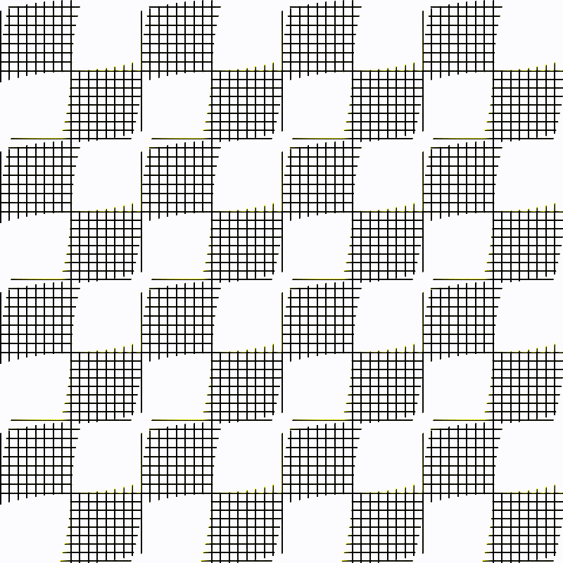

# art-with-code

Exploring art, math and random ideas with [Processing](https://processing.org/) and [P5js](https://p5js.org/) mainly.

Some of this and other ideas porting to Rust [Art with Rust](https://github.com/GoberInfinity/art-with-rust) by Gober Infinity.

| Dancing Squares                              | Dancing Circles                       |
| -------------------------------------------- | ------------------------------------- |
|  |  |

